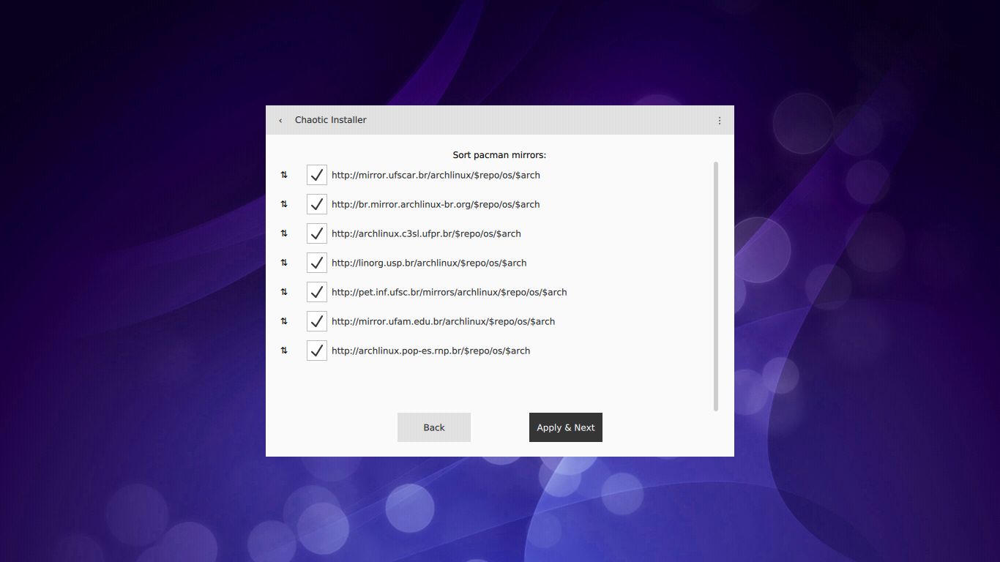

# Niemeyer
A setup wizard for ArchLinux, focusing on generating a customizable mkrootfs, using Qt and compatible with EGLFS.

# Features
 * Compatible with EGLFS:
     * Does not require X11 or Wayland to run.
 * Scriptable customization:
     * The last screen of the wizard is an editable bash script (called mkrootfs) containing all the instructions that produce your setup, including disk, packages, users, and services. This way, you're not restricted by what the GUI proposes. Possibilities are then infinite.
     * This script can be exported to reuse in future installations.
     * The same happens for network connections and partitioning.
 * No package will be installed without your consent.

# Building
## Dependencies
```
pacman -S qt5-base qt5-quickcontrols2 libinput libxkbcommon qmltermwidget
```

## How to build?
```
pacman -S qt5-tools
cd niemeyer
qmake -makefile -project niemeyer.pro
make
lrelease niemeyer.pro
```

## How to run without X/Wayland?
Open a TTY without an open graphical session (`Ctrl+Alt+F3` should do it):

```
export QT_QPA_PLATFORM='eglfs'
./bin/niemeyer
```

# What it looks like?


# Is it related to Chaotic-AUR repository?
Both projects are maintained by the same Pedro, and you'll find a ready to burn ISO with Chaotic Installer available in Chaotic-AUR (soon).
But, this installer doesn't include Chaotic-AUR, any of its packages, and won't offer to add it.